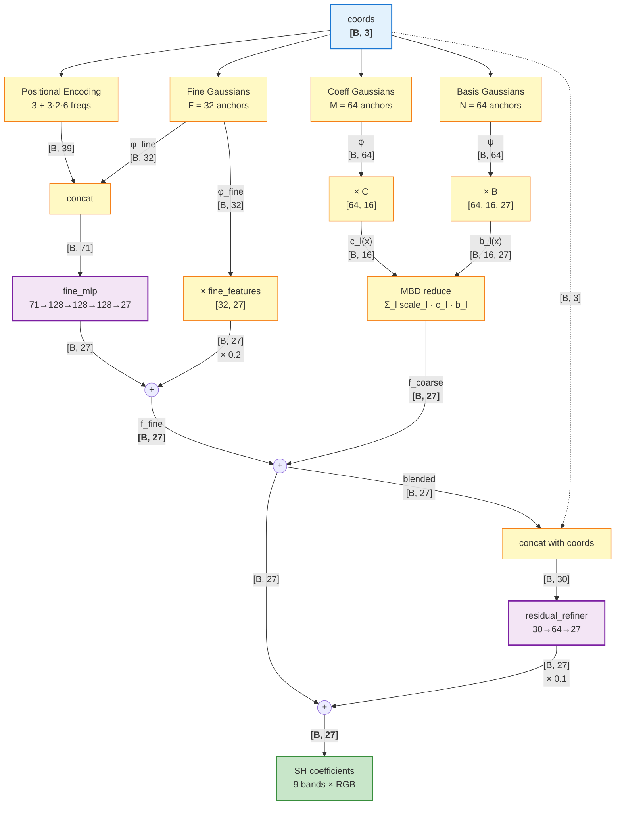

<!-- LANG-SWITCH -->
**Language**: **English** · [简体中文](README.zh-CN.md)

> [!IMPORTANT]
> README is maintained in two languages ([`README.md`](README.md) canonical · [`README.zh-CN.md`](README.zh-CN.md) mirror). **Any change must update both in the same commit.**

---

# HI-NE-GBD: Hierarchical Neural Gaussian Basis Decomposition

[](https://pytorch.org/)
[](https://www.python.org/)
[](HI-NE-GBD/runtime/cpp/)

> **Compress pre-computed light-probe SH coefficients with a hierarchical Gaussian-guided neural decoder, decompress in real time.**

A hierarchical Gaussian-guided Moving Basis Decomposition (MBD) method for efficient compression and real-time decompression of Spherical Harmonics (SH) coefficients from light probes.

**References**:
1. *Moving Basis Decomposition for Precomputed Light Transport* (EGSR 2021)
2. *Gaussian Compression for Precomputed Indirect Illumination* (SIGGRAPH 2025)

## Method Overview

HI-NE-GBD employs a **Coarse-to-Fine hierarchical decoding architecture** that decomposes lighting data into a low-frequency global illumination branch and a high-frequency local detail branch, achieving high-quality reconstruction under high compression ratios.

### Core Equation

$$
f_{\text{final}}(\mathbf{x}) = \underbrace{f_{\text{coarse}}(\mathbf{x})}_{\text{MBD low-freq}} + \underbrace{f_{\text{fine}}(\mathbf{x})}_{\text{Gaussian-guided MLP}} + 0.1 \cdot \underbrace{r(\mathbf{x})}_{\text{27-dim refiner}}
$$

### Data Flow & Channel Dimensions

The diagram below traces a query of $B$ probes through the network. **Edge labels are tensor shapes** — every transformation that changes the channel count is annotated:



> [!NOTE]
> Three independent dimensions co-exist:
> **anchor count** (M=64, N=64, F=32) — how many Gaussian kernels per branch ·
> **basis count** (L=16) — MBD's rank-like factorization width ·
> **data dim** (D=27) — 9 SH bands × 3 RGB channels (interleaved).

### Branch Details

#### Coarse Branch — MBD with 3D Gaussians

$$
f_{\text{coarse}}(\mathbf{x}) = \sum_{l=1}^{L} s_l \cdot c_l(\mathbf{x}) \cdot \mathbf{b}_l(\mathbf{x}), \quad
c_l(\mathbf{x}) = \sum_{m=1}^{M} \varphi_m(\mathbf{x})\, C_{m,l}, \quad
\mathbf{b}_l(\mathbf{x}) = \sum_{n=1}^{N} \psi_n(\mathbf{x})\, \mathbf{B}_{n,l}
$$

Each Gaussian carries full covariance parameters: `position(3) + log_scale(3) + quaternion(4) + alpha(1)` — anisotropic, rotatable, intensity-weighted.

#### Fine Branch — Gaussian-Guided MLP

$$
f_{\text{fine}}(\mathbf{x}) = \text{MLP}\!\big(\text{PE}(\mathbf{x}) \,\Vert\, \boldsymbol{\varphi}_{\text{fine}}(\mathbf{x})\big) + 0.2 \cdot \boldsymbol{\varphi}_{\text{fine}}(\mathbf{x})\, F
$$

Fine Gaussians ($F=32$) are sparse anchors that learn to locate high-frequency regions; their weights condition the MLP, providing spatial awareness on top of positional encoding.

#### Residual Refiner — 27-dim Cross-Channel Correction

A small MLP `[B,30] → [B,27]` that reads the blended output and patches systematic per-channel biases the fine branch can't see.

> [!IMPORTANT]
> **The refiner is not redundant.** A parameter-matched ablation (3 seeds × 3 variants @ ~80,750 params) shows it contributes **+0.55 to +1.07 dB PSNR** vs. spending the same budget on more fine Gaussians or a wider MLP — see [§ Ablation: Why Each Component Stays](#ablation-why-each-component-stays).

### Training Strategy — Three-Stage Curriculum

```mermaid
gantt
    title Coarse-to-Fine Training (3500 epochs total)
    dateFormat X
    axisFormat %s

    section Stage 1 — Coarse Focus
    MBD branch only · λ_c = 0.5  :s1, 0, 500

    section Stage 2 — Joint Training
    All branches · λ_c decays 0.5→0.1   :s2, 500, 2500

    section Stage 3 — Fine Focus
    Fine + MLP + Refiner · λ_c = 0.1   :s3, 3000, 500
```



| Stage | Epochs | What's optimised | $\lambda_{\text{coarse}}$ |
|:-----:|-------:|------------------|:------------------------:|
| 1 | 500  | Coarse Gaussians + MBD tensors only | 0.5 (high) |
| 2 | 2500 | All branches jointly                 | 0.5 → 0.1 (decay) |
| 3 | 500  | Fine Gaussians + Fine MLP + Refiner  | 0.1 (low) |

### Loss

$$
\mathcal{L}_{\text{total}} = \mathcal{L}_{\text{final}} + \lambda_{\text{coarse}} \cdot \mathcal{L}_{\text{coarse}} + \lambda_{\text{reg}} \cdot \mathcal{L}_{\text{reg}}
$$

- $\mathcal{L}_{\text{final}}$: reconstruction MSE — channel weights $w_c \propto 1/\sigma_c^2$ balance gradients across SH orders.
- $\mathcal{L}_{\text{coarse}}$: intermediate supervision pinning the MBD branch on the low-frequency target.
- $\mathcal{L}_{\text{reg}}$: scale-norm regulariser preventing Gaussian-scale explosion.

### Ablation: Why Each Component Stays

<details>
<summary><b>Click to expand</b> — parameter-matched ablation of the residual refiner</summary>

To check whether the residual refiner is "wasted parameters," we ran a parameter-matched ablation: each variant has ~80,750 trainable params, 3 seeds × 3500 epochs + FP16 quantization, real probe data.

| Variant | Description | PSNR (mean ± std) | SSIM | Params |
|---------|-------------|------------------:|:----:|-------:|
| **A**: with refiner | F=32, h=128, +residual_refiner (production) | **40.32 ± 0.49** | **0.9482** | 80,774 |
| B: more fine Gaussians | F=54, h=128, no refiner | 39.25 ± 0.61 | 0.9348 | 80,687 |
| C: wider fine MLP    | F=32, h=134, no refiner | 39.85 ± 0.07 | 0.9409 | 80,785 |
| D: fine sees coarse  | fine_mlp gets coarse_output as input, no refiner | 39.55 ± 0.45 | 0.9353 | 80,491 |

**The refiner wins all three pairings**: +1.07 dB over B, +0.47 dB over C, +0.77 dB over D. Reallocating the same budget into wider/denser fine layers cannot recover the gain — the refiner occupies a structurally unique position: it is the only component that sees the **27-dim blended output** and can correct cross-channel correlated errors (e.g., L0_R and L0_G drifting together) that the coordinate-conditioned fine MLP can't observe.

</details>

## Data Format

### Input: ILCSampleData (.bin)

Each probe consists of 32 floats:
- Position: 3 floats (x, y, z) — world coordinates
- Radius: 1 float
- SH Coefficients: 27 floats (9 SH bands × 3 RGB, RGB-interleaved)
  - Storage order: `[SH0_R, SH0_G, SH0_B, SH1_R, SH1_G, SH1_B, ..., SH8_R, SH8_G, SH8_B]`
- Shadow: 1 float

### Output: Compressed Model (.pth)

Contains all learnable parameters (FP16 quantized storage), supporting real-time decompression of SH coefficients at arbitrary coordinates.

## Project Structure

```
.
├── docs/
│   └── architecture.png          # Architecture diagram (project doc)
├── HI-NE-GBD/                    # Production pipeline (use this)
│   ├── buildtime/
│   │   ├── HI-NE-GBD.py          #   Main training script (offline compression)
│   │   └── probe_reader.py       #   Probe data reader utility
│   ├── runtime/
│   │   ├── decoder.py            #   Real-time decoder (Python)
│   │   ├── export_model.py       #   PyTorch -> UCommon .uasset exporter
│   │   └── cpp/                  #   C++ runtime (MSVC)
│   │       ├── HINEGBD.h/cpp     #     decoder library
│   │       ├── main.cpp          #     demo entry point
│   │       └── CMakeLists.txt
│   └── probedata/
│       └── ILCSampleData_0.bin   #   Light probe raw data (only copy)
├── experiments/
│   ├── ablation/                 # Component ablations (mostly synthetic signals)
│   │   ├── HI-NE-GBD.py          #   Real-probe re-train without saving (visualize-only)
│   │   ├── MBD_gaussian.py       #   No-MLP variant (synthetic)
│   │   ├── MBD_gaussian_MLP.py   #   Non-hierarchical variant (synthetic)
│   │   └── gaussian_MLP.py       #   No-MBD variant (synthetic)
│   └── legacy/                   # Earlier exploratory scripts (synthetic only)
└── output/                       # Saved figures from prior runs
```

`compressed_model.pth` (training output) and `hinegbd_model.uasset` (exporter output) are not checked in — they are produced by running the buildtime / export scripts.

## Usage

Scripts use paths relative to `__file__`, so any working directory works.

### 1. Training (Offline Compression)

```bash
python HI-NE-GBD/buildtime/HI-NE-GBD.py
```

Trains for 3500 epochs (500 coarse + 2500 joint + 500 fine) on `HI-NE-GBD/probedata/ILCSampleData_0.bin` and writes `HI-NE-GBD/runtime/compressed_model.pth` (FP16-quantized).

### 2. Real-time Decompression (Python)

```python
from decoder import HINEGBDDecoder

decoder = HINEGBDDecoder("compressed_model.pth")

# Single point query (world coordinates)
sh_coeffs = decoder.decode(x=100.0, y=50.0, z=-200.0)

# Batch query
import numpy as np
coords = np.array([[100, 50, -200], [110, 60, -180]], dtype=np.float32)
sh_batch = decoder.decode_batch(coords)
```

### 3. Interactive / Benchmark / Single-point CLI

```bash
python HI-NE-GBD/runtime/decoder.py --interactive
python HI-NE-GBD/runtime/decoder.py --benchmark
python HI-NE-GBD/runtime/decoder.py --coords 100 50 -200            # world coords
python HI-NE-GBD/runtime/decoder.py --coords 0.5 0.5 0.5 --normalized
```

`--device {cpu,cuda}` overrides auto-detection; `--model PATH` overrides the default `compressed_model.pth`.

### 4. Export to C++ Runtime

```bash
python HI-NE-GBD/runtime/export_model.py \
  --model compressed_model.pth --output hinegbd_model.uasset --verify
```

Then build the C++ demo (Windows / MSVC):

```bash
cmake -S HI-NE-GBD/runtime/cpp -B HI-NE-GBD/runtime/cpp/build
cmake --build HI-NE-GBD/runtime/cpp/build --config Release
HI-NE-GBD/runtime/cpp/build/bin/HINEGBD_Demo.exe hinegbd_model.uasset
```

## Model Configuration (Default Parameters)

| Parameter | Value | Description |
|-----------|-------|-------------|
| `num_bases` (L) | 16 | Number of MBD bases |
| `coeff_res` (M) | 64 | Number of coefficient Gaussians |
| `basis_res` (N) | 64 | Number of basis Gaussians |
| `data_dim` (D) | 27 | Data dimension (SH coefficients) |
| `fine_gaussian_res` (F) | 32 | Number of fine Gaussian anchors |
| `mlp_hidden` | 128 | MLP hidden layer size |
| `pe_num_freqs` | 6 | Number of positional encoding frequencies |
| `fine_mlp_depth` | 3 | Fine MLP depth |
| `fine_kernel_scale` | 0.05 | Fine Gaussian initial scale |

## Key Innovations

1. **Hierarchical Decoding**: MBD for low-frequency + Gaussian+MLP for high-frequency
2. **Fine Gaussians**: Sparse anchors that adaptively learn high-frequency regions (edges, shadow transitions)
3. **Gaussian-Guided MLP**: Gaussian weights provide spatial awareness, guiding MLP to learn local details
4. **MBD Learnable Scale**: Per-basis learnable scale factors
5. **Positional Encoding**: Sinusoidal encoding to enhance high-frequency learning
6. **Additive Residual Blending**: No gate network overhead (coarse + fine)
7. **Intermediate Supervision**: Independent supervision on the coarse branch
8. **Curriculum Learning**: λ_coarse decays gradually during training
9. **Per-Channel Variance-Inverse Weighting**: Balances gradients across SH orders
10. **FP16 Post-Training Quantization**: Float16 quantization after training, doubling compression ratio

## Evaluation Metrics

- **PSNR** (Peak Signal-to-Noise Ratio): Per-channel PSNR averaged
- **SSIM** (Structural Similarity): Sliding-window SSIM based on Morton Z-order spatial sorting
- **Compression Ratio**: Original data size / compressed model size
- **Per-SH-Order Breakdown**: Separate evaluation for each SH order (L0/L1/L2)

## Dependencies

- Python 3.8+
- PyTorch >= 1.10
- NumPy
- SciPy
- Matplotlib

## Ablation Studies

The `experiments/ablation/` directory contains ablation scripts for individual components (run on synthetic signals from `test_signal_3d.py`, except where noted):
- `MBD_gaussian.py`: MBD + Gaussian (no MLP)
- `MBD_gaussian_MLP.py`: MBD + Gaussian + MLP
- `gaussian_MLP.py`: Gaussian + MLP (no MBD)
- `HI-NE-GBD.py`: hierarchical model run on real probe data (`ILCSampleData_0.bin`)

`experiments/legacy/` keeps earlier exploratory scripts (`opt.py`, `HI_TEST.py`, `MBD_*.py`, `gaussian_control.py`) for historical reference.

