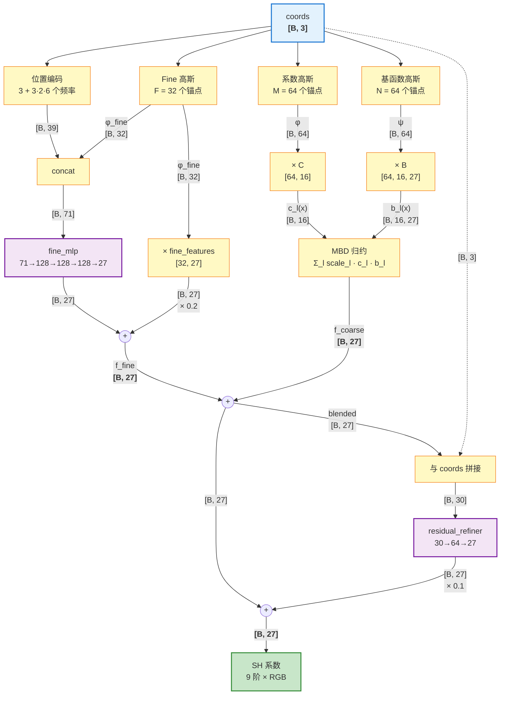

<!-- LANG-SWITCH -->
**Language**: **简体中文** · [English](README.md)

> [!IMPORTANT]
> README 维护两份语言版本（[`README.md`](README.md) 主版本 · [`README.zh-CN.md`](README.zh-CN.md) 镜像），**任何改动须同时同步两份**。

---

# HI-NE-GBD：层级化神经高斯基分解

[](https://pytorch.org/)
[](https://www.python.org/)
[](HI-NE-GBD/runtime/cpp/)

> **用层级化的高斯引导神经解码器压缩预计算光照探针的球谐系数，并支持实时解压。**

一种基于高斯引导的 Moving Basis Decomposition (MBD) 层级方法，用于光照探针球谐 (SH) 系数的高效压缩与实时解压。

**参考文献**：
1. *Moving Basis Decomposition for Precomputed Light Transport*（EGSR 2021）
2. *Gaussian Compression for Precomputed Indirect Illumination*（SIGGRAPH 2025）

## 方法概述

HI-NE-GBD 采用 **Coarse-to-Fine（粗到细）层级解码架构**，把光照数据拆为低频全局光照分支与高频局部细节分支，在高压缩比下仍能保持高质量重建。

### 核心方程

$$
f_{\text{final}}(\mathbf{x}) = \underbrace{f_{\text{coarse}}(\mathbf{x})}_{\text{MBD 低频}} + \underbrace{f_{\text{fine}}(\mathbf{x})}_{\text{高斯引导 MLP}} + 0.1 \cdot \underbrace{r(\mathbf{x})}_{\text{27 维精修器}}
$$

### 数据流与通道维度

下图追踪一批 $B$ 个探针在网络中的流动。**边上的标注就是张量形状** —— 每一处通道维度变化都标了出来：



> [!NOTE]
> 三个独立维度并存：
> **锚点数** (M=64, N=64, F=32) — 每个分支用多少高斯核 ·
> **基数量** (L=16) — MBD 类似秩分解的宽度 ·
> **数据维度** (D=27) — 9 阶 SH × 3 RGB（交错存储）。

### 各分支详解

#### Coarse 分支 — 带 3D 高斯的 MBD

$$
f_{\text{coarse}}(\mathbf{x}) = \sum_{l=1}^{L} s_l \cdot c_l(\mathbf{x}) \cdot \mathbf{b}_l(\mathbf{x}), \quad
c_l(\mathbf{x}) = \sum_{m=1}^{M} \varphi_m(\mathbf{x})\, C_{m,l}, \quad
\mathbf{b}_l(\mathbf{x}) = \sum_{n=1}^{N} \psi_n(\mathbf{x})\, \mathbf{B}_{n,l}
$$

每个高斯都带完整协方差参数：`position(3) + log_scale(3) + quaternion(4) + alpha(1)` —— 各向异性、可旋转、强度可调。

#### Fine 分支 — 高斯引导 MLP

$$
f_{\text{fine}}(\mathbf{x}) = \text{MLP}\!\big(\text{PE}(\mathbf{x}) \,\Vert\, \boldsymbol{\varphi}_{\text{fine}}(\mathbf{x})\big) + 0.2 \cdot \boldsymbol{\varphi}_{\text{fine}}(\mathbf{x})\, F
$$

Fine 高斯（$F=32$ 个）是稀疏锚点，自适应学习高频区域；它们的权重作为 MLP 的条件输入，在位置编码之上额外提供空间感知。

#### 残差精修器 — 27 维跨通道修正

一个小 MLP `[B,30] → [B,27]`，读取融合后的输出，修正 fine 分支看不见的、按通道相关的系统性偏差。

> [!IMPORTANT]
> **精修器并非冗余设计。** 参数对齐的消融（3 seeds × 3 变体 @ 约 80,750 参数）证明：相同参数预算下，把它换成更多 fine 高斯或更宽的 MLP，PSNR 都会**下降 0.55 ~ 1.07 dB** —— 详见[§ 消融研究：每个组件为何保留](#消融研究每个组件为何保留)。

### 训练策略 — 三阶段课程学习

```mermaid
gantt
    title Coarse-to-Fine 训练（共 3500 epoch）
    dateFormat X
    axisFormat %s

    section Stage 1 — Coarse Focus
    仅 MBD 分支 · λ_c = 0.5  :s1, 0, 500

    section Stage 2 — Joint Training
    全部分支 · λ_c 衰减 0.5→0.1   :s2, 500, 2500

    section Stage 3 — Fine Focus
    Fine + MLP + 精修器 · λ_c = 0.1   :s3, 3000, 500
```



| 阶段 | Epochs | 优化目标 | $\lambda_{\text{coarse}}$ |
|:----:|-------:|---------|:------------------------:|
| 1 | 500  | 仅 Coarse 高斯 + MBD 张量 | 0.5（高） |
| 2 | 2500 | 全部分支联合训练           | 0.5 → 0.1（衰减） |
| 3 | 500  | Fine 高斯 + Fine MLP + 精修器 | 0.1（低） |

### 损失函数

$$
\mathcal{L}_{\text{total}} = \mathcal{L}_{\text{final}} + \lambda_{\text{coarse}} \cdot \mathcal{L}_{\text{coarse}} + \lambda_{\text{reg}} \cdot \mathcal{L}_{\text{reg}}
$$

- $\mathcal{L}_{\text{final}}$：重建 MSE —— 通道权重 $w_c \propto 1/\sigma_c^2$ 平衡各阶 SH 上的梯度。
- $\mathcal{L}_{\text{coarse}}$：对 MBD 分支做中间监督，让它专注学习低频。
- $\mathcal{L}_{\text{reg}}$：高斯尺度的 L2 正则，防止 scale 爆炸。

### 消融研究：每个组件为何保留

<details>
<summary><b>点击展开</b> — 残差精修器的参数对齐消融</summary>

为了检验残差精修器是不是"浪费的参数"，我们做了参数对齐的消融：每个变体约 80,750 个可训练参数，3 seed × 3500 epoch + FP16 量化，真实探针数据。

| 变体 | 描述 | PSNR (mean ± std) | SSIM | 参数 |
|------|------|------------------:|:----:|-----:|
| **A**：保留精修器 | F=32, h=128, +residual_refiner（生产配置） | **40.32 ± 0.49** | **0.9482** | 80,774 |
| B：更多 fine 高斯 | F=54, h=128, 不带精修器 | 39.25 ± 0.61 | 0.9348 | 80,687 |
| C：更宽 fine MLP   | F=32, h=134, 不带精修器 | 39.85 ± 0.07 | 0.9409 | 80,785 |
| D：fine 看到 coarse | fine_mlp 输入加上 coarse_output，不带精修器 | 39.55 ± 0.45 | 0.9353 | 80,491 |

**精修器在三组对照中全部胜出**：领先 B 1.07 dB、C 0.47 dB、D 0.77 dB。把同样的参数预算换到更宽/更密的 fine 层都补不回来 —— 精修器占据了结构上独一无二的位置：它是模型里**唯一能看到 27 维融合输出**、能修正跨通道相关误差（例如 L0_R 和 L0_G 一同偏移）的组件，而坐标条件化的 fine MLP 看不见这种模式。

</details>

## 数据格式

### 输入：ILCSampleData (.bin)

每个探针 32 个 float：
- 位置：3 floats (x, y, z)，世界坐标
- 半径：1 float
- SH 系数：27 floats (9 个 SH 阶次 × 3 RGB，RGB 交错存储)
  - 存储顺序：`[SH0_R, SH0_G, SH0_B, SH1_R, SH1_G, SH1_B, ..., SH8_R, SH8_G, SH8_B]`
- Shadow：1 float

### 输出：压缩模型 (.pth)

包含全部可学习参数（FP16 量化存储），支持任意坐标的实时 SH 系数解压。

## 项目结构

```
.
├── docs/
│   └── architecture.png          # 架构图（项目级文档）
├── HI-NE-GBD/                    # 生产管线（用这套）
│   ├── buildtime/
│   │   ├── HI-NE-GBD.py          #   主训练脚本（离线压缩）
│   │   └── probe_reader.py       #   探针读取工具
│   ├── runtime/
│   │   ├── decoder.py            #   实时解压器（Python）
│   │   ├── export_model.py       #   PyTorch -> UCommon .uasset 导出器
│   │   └── cpp/                  #   C++ 运行时（MSVC）
│   │       ├── HINEGBD.h/cpp     #     解码库
│   │       ├── main.cpp          #     demo 入口
│   │       └── CMakeLists.txt
│   └── probedata/
│       └── ILCSampleData_0.bin   #   光照探针原始数据（仓库唯一一份）
├── experiments/
│   ├── ablation/                 # 组件消融脚本（多数跑合成信号）
│   │   ├── HI-NE-GBD.py          #   真实探针重训（不保存模型，只可视化）
│   │   ├── MBD_gaussian.py       #   去掉 MLP（合成信号）
│   │   ├── MBD_gaussian_MLP.py   #   非层级版（合成信号）
│   │   └── gaussian_MLP.py       #   去掉 MBD（合成信号）
│   └── legacy/                   # 早期探索脚本（仅合成信号）
└── output/                       # 历史运行的图片
```

`compressed_model.pth`（训练产出）和 `hinegbd_model.uasset`（导出产出）不入库——通过运行 buildtime / export 脚本产生。

## 使用方法

脚本路径都基于 `__file__`，从任意工作目录调用都能跑。

### 1. 训练（离线压缩）

```bash
python HI-NE-GBD/buildtime/HI-NE-GBD.py
```

在 `HI-NE-GBD/probedata/ILCSampleData_0.bin` 上跑 3500 epochs（500 coarse + 2500 joint + 500 fine），写出 `HI-NE-GBD/runtime/compressed_model.pth`（FP16 量化）。

### 2. 实时解压（Python）

```python
from decoder import HINEGBDDecoder

decoder = HINEGBDDecoder("compressed_model.pth")

# 单点查询（世界坐标）
sh_coeffs = decoder.decode(x=100.0, y=50.0, z=-200.0)

# 批量查询
import numpy as np
coords = np.array([[100, 50, -200], [110, 60, -180]], dtype=np.float32)
sh_batch = decoder.decode_batch(coords)
```

### 3. 交互式 / Benchmark / 单点查询命令行

```bash
python HI-NE-GBD/runtime/decoder.py --interactive
python HI-NE-GBD/runtime/decoder.py --benchmark
python HI-NE-GBD/runtime/decoder.py --coords 100 50 -200            # 世界坐标
python HI-NE-GBD/runtime/decoder.py --coords 0.5 0.5 0.5 --normalized
```

`--device {cpu,cuda}` 覆盖自动检测；`--model PATH` 覆盖默认 `compressed_model.pth`。

### 4. 导出到 C++ 运行时

```bash
python HI-NE-GBD/runtime/export_model.py \
  --model compressed_model.pth --output hinegbd_model.uasset --verify
```

接着构建 C++ demo（Windows / MSVC）：

```bash
cmake -S HI-NE-GBD/runtime/cpp -B HI-NE-GBD/runtime/cpp/build
cmake --build HI-NE-GBD/runtime/cpp/build --config Release
HI-NE-GBD/runtime/cpp/build/bin/HINEGBD_Demo.exe hinegbd_model.uasset
```

## 模型配置（默认参数）

| 参数 | 值 | 说明 |
|------|------|------|
| `num_bases` (L) | 16 | MBD 基函数数量 |
| `coeff_res` (M) | 64 | 系数高斯数量 |
| `basis_res` (N) | 64 | 基函数高斯数量 |
| `data_dim` (D) | 27 | 数据维度（SH 系数）|
| `fine_gaussian_res` (F) | 32 | Fine 高斯锚点数量 |
| `mlp_hidden` | 128 | MLP 隐藏层大小 |
| `pe_num_freqs` | 6 | 位置编码频率数 |
| `fine_mlp_depth` | 3 | Fine MLP 深度 |
| `fine_kernel_scale` | 0.05 | Fine 高斯初始尺度 |

## 关键创新点

1. **层级解码**：MBD 处理低频 + 高斯+MLP 处理高频
2. **Fine Gaussians**：稀疏锚点自适应学习高频区域（边缘、阴影过渡）
3. **高斯引导 MLP**：高斯权重提供空间感知，引导 MLP 学习局部细节
4. **MBD 可学习 Scale**：每个基函数有独立可学习的 scale 因子
5. **位置编码**：正弦位置编码增强高频学习能力
6. **加性残差融合**：无 gate 网络开销（coarse + fine 直接相加）
7. **中间监督**：对 Coarse 分支独立监督
8. **课程学习**：λ_coarse 在训练过程中渐降
9. **按通道方差倒数加权**：均衡各 SH 阶次的梯度
10. **FP16 后训练量化**：训练后做 Float16 量化，压缩比加倍

## 评估指标

- **PSNR**（峰值信噪比）：按通道 PSNR 取均值
- **SSIM**（结构相似度）：基于 Morton Z 序空间排序的滑窗 SSIM
- **压缩比**：原始数据大小 / 压缩模型大小
- **按 SH 阶次拆分**：分别评估各阶 SH（L0/L1/L2）

## 依赖

- Python 3.8+
- PyTorch >= 1.10
- NumPy
- SciPy
- Matplotlib

## 消融研究

`experiments/ablation/` 目录下含组件消融脚本（除标注外均跑 `test_signal_3d.py` 的合成信号）：
- `MBD_gaussian.py`：MBD + 高斯（去 MLP）
- `MBD_gaussian_MLP.py`：MBD + 高斯 + MLP（非层级）
- `gaussian_MLP.py`：高斯 + MLP（去 MBD）
- `HI-NE-GBD.py`：层级版完整模型，跑真实探针数据 (`ILCSampleData_0.bin`)

`experiments/legacy/` 留存早期探索脚本（`opt.py`、`HI_TEST.py`、`MBD_*.py`、`gaussian_control.py`），作历史参考。
